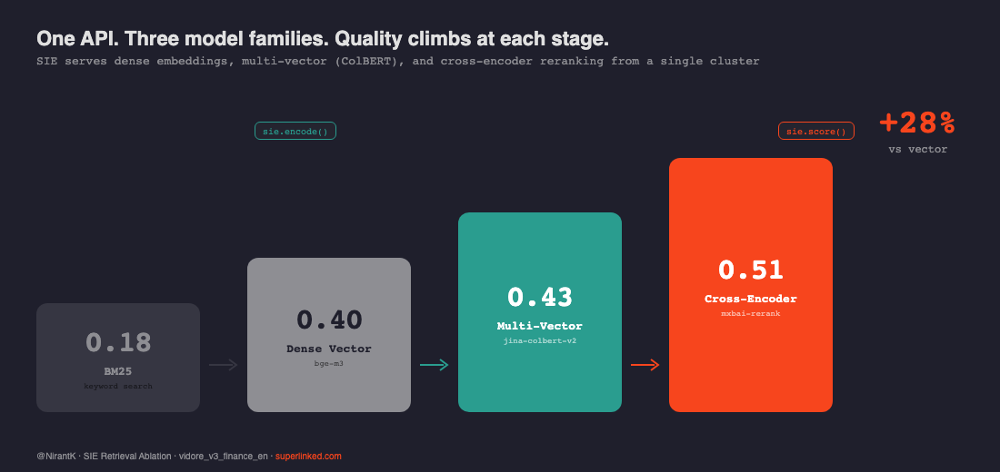
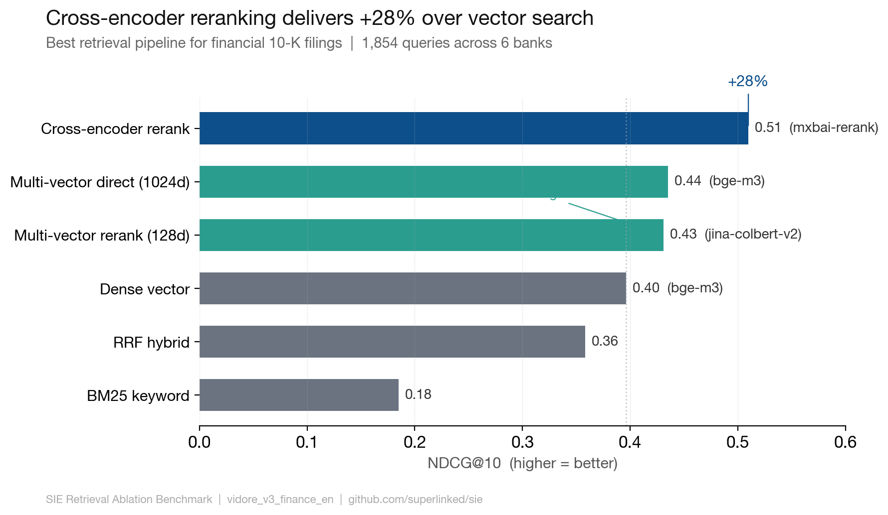

# How to Get the Best Retrieval Pipeline for Financial Document Search

One SIE cluster. Seven models. One API call each. No model serving to manage.





This example benchmarks 6 retrieval strategies on real SEC 10-K filings to answer: **what combination of embedding, reranking, and late-interaction models actually works best for page-level document search?**

The answer matters because most teams pick one model and hope for the best. We tested all the approaches — BM25, dense vector, RRF fusion, cross-encoder reranking, and multi-vector (ColBERT) scoring — against the same 1,854 queries on 2,942 pages from 6 major banks.

## Start Here

```python
from sie_sdk import SIEAsyncClient

async with SIEAsyncClient("http://your-sie-endpoint:8080", api_key="SL-...") as sie:
    # Dense embedding — one line
    dense = await sie.encode("BAAI/bge-m3", [{"text": "quarterly revenue"}],
                              output_types=["dense"])

    # Multi-vector (ColBERT) — same API, different output
    colbert = await sie.encode("jinaai/jina-colbert-v2", [{"text": "quarterly revenue"}],
                                output_types=["multivector"])

    # Cross-encoder reranking — scores query against each candidate
    result = await sie.score("mixedbread-ai/mxbai-rerank-base-v2",
                              query={"text": "quarterly revenue"},
                              items=[{"text": "Revenue was $50B..."},
                                     {"text": "The board met on Tuesday..."}])
```

Three model families. One endpoint. No container orchestration.

> *Benchmark by [@NirantK](https://twitter.com/NirantK) for [Superlinked](https://superlinked.com)*

## Results

| Strategy | Model | NDCG@10 | Recall@10 | What it shows |
|----------|-------|---------|-----------|---------------|
| **CE Rerank** | mxbai-rerank-large | **0.600** | **0.640** | Best quality: +52% over vector |
| CE Rerank | mxbai-rerank-base | 0.524 | 0.588 | Strong, smaller alternative |
| CE Rerank | bge-reranker | 0.521 | 0.578 | Near-identical to mxbai-base |
| MV Direct | bge-m3 (1024d) | 0.435 | 0.482 | No GPU at inference, +10% over vector |
| MV Rerank | jina-colbert-v2 (128d) | 0.431 | 0.494 | 96% of bge-m3 quality at 12.5% storage |
| Vector | bge-m3 dense | 0.396 | 0.438 | Strong baseline |
| RRF | BM25+Vector | 0.358 | 0.434 | Hybrid hurts here — BM25 dilutes signal |
| BM25 | Turbopuffer FTS | 0.185 | 0.239 | Keyword search alone isn't enough |

See [RESULTS.md](RESULTS.md) for full methodology, all conditions, and pool optimization experiments.

## What This Shows About SIE

- **Model-agnostic**: swap bge-m3 for jina-colbert-v2 with one parameter change
- **Multi-model pipelines**: dense encode → hybrid retrieval → cross-encoder rerank in one script, one cluster
- **90+ models available**: not locked into one vendor's embeddings
- **Async-native**: fire hundreds of concurrent requests, SIE handles batching and GPU scheduling

## API Keys Required

| Service | What for | Get one at |
|---------|---------|------------|
| **SIE** | Encoding, scoring, multi-vector | Self-hosted ([deploy guide](https://github.com/superlinked/sie)) or contact team |
| **Turbopuffer** | BM25 + vector search index | [turbopuffer.com](https://turbopuffer.com) |
| **HuggingFace** | Dataset download (free, cached) | [huggingface.co/settings/tokens](https://huggingface.co/settings/tokens) |

Create `.env` in this directory:

```
SIE_BASE_URL=http://your-sie-endpoint:8080
SIE_API_KEY=SL-...
TURBOPUFFER_API_KEY=tpuf_...
```

## Run the Benchmark

```bash
# Install
uv sync

# Validate config (no GPU needed)
uv run python benchmark_ablation.py --dry-run

# Full benchmark — all 6 conditions, all models
uv run python benchmark_ablation.py --gpu l4-spot

# Just cross-encoder reranking (needs GPU)
uv run python benchmark_ablation.py --gpu l4-spot --skip-conditions 5,6

# Just multi-vector scoring (CPU after encoding)
uv run python benchmark_ablation.py --skip-conditions 1,2,3,4 --mv-models jina-colbert

# Pick your models
uv run python benchmark_ablation.py --ce-models mxbai-rerank --mv-models bge-m3,jina-colbert
```

All expensive operations (encoding, search) cache to `cache/ablation/`. Re-runs skip completed steps. CE reranking checkpoints every 100 queries for crash recovery.

## The Recommendation

For **financial document search** on this dataset:

1. **Best quality**: Vector retrieval → Cross-encoder rerank with mxbai-rerank-large (NDCG=0.60). Needs GPU for reranking. Larger candidate pools (top-50) improve quality further.
2. **Best without GPU at inference**: Multi-vector direct with bge-m3 (NDCG=0.44). Pre-encode offline, search with MaxSim on CPU.
3. **Best cost/quality**: jina-colbert-v2 multi-vector (NDCG=0.43). 128d vectors = 8x less storage than bge-m3 MV, nearly identical quality.

## Dependencies

- [SIE SDK](https://github.com/superlinked/sie) — async encode, score, extract
- [Turbopuffer](https://turbopuffer.com) — BM25 + vector search
- [maxsim-cpu](https://github.com/mixedbread-ai/maxsim-cpu) — optimized ColBERT MaxSim scoring
- [datasets](https://huggingface.co/docs/datasets) — HuggingFace dataset loading (cached locally)
