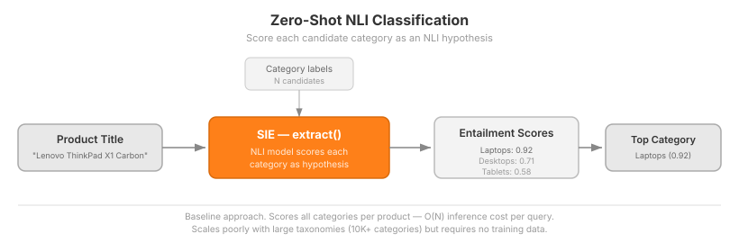
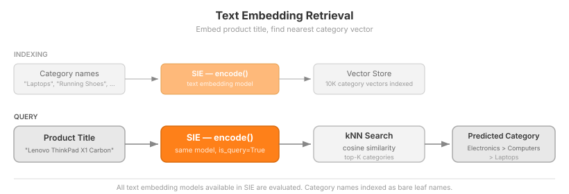
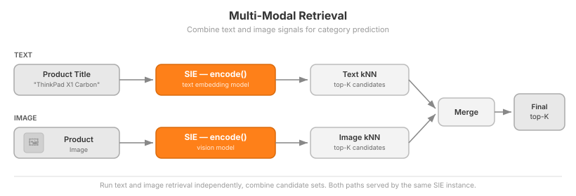
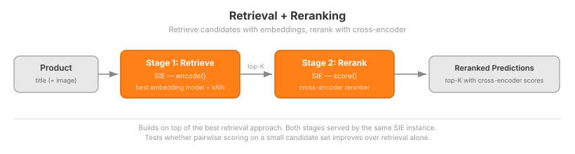

# Taxonomy Classification with SIE

Classify products into a large hierarchical taxonomy using SIE as the unified inference layer.

## Problem

Taxonomy classification assigns a category path (e.g. `Electronics > Computers > Laptops`) to a product given its title, description, and/or image. Real-world taxonomies are large (10K+ categories), hierarchical (up to 8 levels deep), and ambiguous (multiple categories can be valid for the same product).

Google's [Custom Taxonomy Classifier](https://github.com/google-marketing-solutions/custom-taxonomy-classifier) demonstrates a minimal version of this: embed flat category names with a single Vertex AI model, retrieve the nearest neighbor. This project goes further — we systematically evaluate multiple approaches across text, vision, and hybrid modalities on a hierarchical taxonomy.

## Why SIE

Taxonomy classification is not a single-model problem. Finding the best approach requires experimenting with fundamentally different model types:

| SIE capability | Model type | Role |
|---------------|-----------|------|
| `extract` | NLI / zero-shot classifiers | Score query-category entailment |
| `encode` | Text embedding models | Embed products and categories for retrieval |
| `encode` | Vision models (CLIP, SigLIP) | Embed product images for retrieval |
| `score` | Cross-encoder rerankers | Rerank retrieval candidates |

SIE serves all of these behind a single API. Switching from text embeddings to NLI to image retrieval to cross-encoder reranking requires changing one parameter, not rebuilding infrastructure. This makes it practical to run a structured evaluation across approaches that would otherwise each need their own serving stack.

## Dataset

[Shopify/product-catalogue](https://huggingface.co/datasets/Shopify/product-catalogue) — 48K products with titles, descriptions, images, and hierarchical category labels from the [Shopify Product Taxonomy](https://github.com/Shopify/product-taxonomy).

Key properties:
- **10,476 categories** across up to 8 hierarchy levels — trimmed to 3 levels for this project to keep evaluation contained
- **`potential_product_categories`** field provides a shortlist of plausible categories per product — useful for evaluating reranking and measuring label ambiguity
- **Product images** included — enables vision-based approaches
- **Pre-split** 80/20 train/test

Metrics are calculated against both the single ground-truth label and the `potential_product_categories` set, showing the gap between strict and lenient evaluation.

## Approaches

### Zero-Shot NLI Classification

Use NLI models via `sie.extract()` to score each candidate category as a natural language hypothesis. No training data needed. Serves as the baseline, but scales poorly with large label spaces.

### Text Embedding Retrieval

Embed category names and product titles with text embedding models via `sie.encode()`. Index category embeddings in a vector store (e.g. Qdrant). At query time, retrieve the nearest categories by cosine similarity. All text embedding models available in SIE are evaluated.

### Image Embedding Retrieval

Embed product images and category names using vision models via `sie.encode()`. Predict categories from product images alone — tests whether visual signal is sufficient for taxonomy classification. All vision models available in SIE are evaluated.

### Multi-Modal Retrieval

Use both product title and image to predict categories. A simple approach: run text and image retrieval independently and combine the candidate sets. Models that natively handle both modalities (e.g. CLIP-family) can also encode text and images into the same vector space.

### Retrieval + Reranking

Two-stage pipeline: retrieve top-K candidates using the best embedding approach, then rerank with cross-encoder models via `sie.score()`. Tests whether fine-grained pairwise scoring can improve upon retrieval alone. All cross-encoder rerankers available in SIE are evaluated.

## Research Questions

- Which modality (text, image, multi-modal) works best for which category types?
- Does reranking improve retrieval, or does it degrade?
- How does the gap between strict (single ground-truth) and lenient (`potential_product_categories`) evaluation inform metric selection?
- How does per-level accuracy change across L1, L2, L3?
- How much does model size matter? Do small embedding models (< 500M params) compete with large ones (7B+) on this task?
- What is the recall@K ceiling — how many candidates do you need to get recall@K ~90%?

## More Approaches to Try (Out of Scope)

Ideas that are out of scope for the initial evaluation but worth exploring later:

- **LLM-enriched category names** — use an LLM to generate descriptions for each category node, then embed the descriptions instead of bare names. Adds complexity and cost to the indexing step.
- **Hierarchical cascade** — classify L1 first, then L2 within the predicted L1, then L3. Requires high accuracy at each level to avoid error propagation.
- **Fine-tuned embeddings** — train a contrastive model on (product, category) pairs from the training split. The Shopify dataset is large enough to support this.
