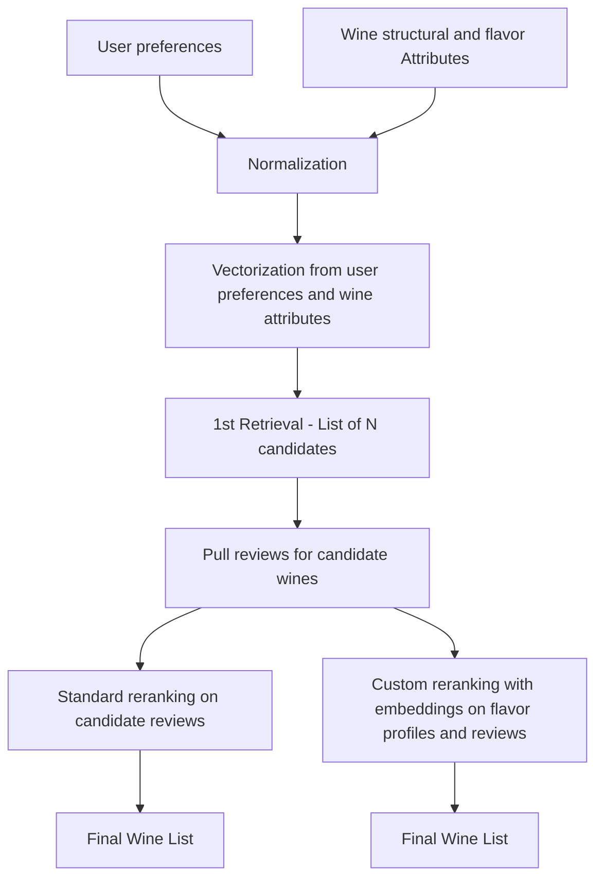
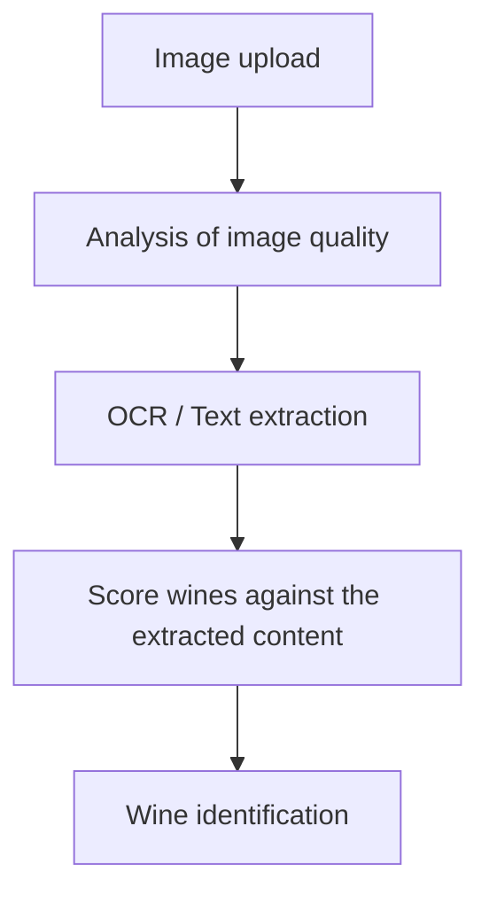

# WineRetrieval

This example is mostly a demo app, not a scaled production system. It is meant to demonstrate the capabilities of the [SIE](https://sie.dev/docs/).

It wires together two separate prototype features:

- `wine_flavor/`: wine retrieval and reranking from flavor + structure preferences. This uses both the [encode](https://sie.dev/docs/encode) and [score](https://sie.dev/docs/score) primitives of the SIE.
- `wine_picture_detection/`: OCR-based wine label detection, using the [extract](https://sie.dev/docs/extract) primitive.

Those two pieces are connected through the root `app.py` so you can try them in one UI, but they are also meant to be runnable on their own from inside their own folders. Please refer to the instructions in the README in each sub-folder to do so.

The duplicated database files (`wine_flavor.db`) and local `.env` setup are intentional. The goal is to let someone open either subproject directly and run it in isolation without depending on the full root app setup.

## Project Structure

- Root `app.py`: demo backend that wires OCR and retrieval into one FastAPI app
- `app/`: Next.js frontend for the demo UI
- `wine_flavor/`: standalone retrieval and reranking prototype
- `wine_picture_detection/`: standalone OCR and label-matching prototype

## Schema Design

### Wine Recommendation



### Wine Identification



## Pre-requisite

In order to run this demo, you will need to start the SIE server. Please refer to the [SIE quickstart page](https://sie.dev/docs/quickstart) for detailed instructions

## Running the full Demo

The full app runs through Docker Compose:

- `backend`: FastAPI on `http://localhost:8000`
- `frontend`: Next.js on `http://localhost:3000`

From the repo root:

```bash
docker compose up --build
```

App URLs:

- Frontend: `http://localhost:3000`
- Backend: `http://localhost:8000`

Stop it with:

```bash
docker compose down
```

## Environment Files

- The root app and `wine_flavor/` subproject use the root `.env`
- `wine_picture_detection/` can also use its own local `.env` / `.env.example`
- The duplicated setup is intentional so both subprojects can be run individually

If you are running the full demo, put the required backend keys in the root `.env`.

## Notes

- This repo is optimized for demoing the product idea, not for production deployment or large-scale operation.
- The main app is intentionally simple: `app.py` wires together the OCR module and the retrieval module rather than hiding them behind a larger service architecture.
